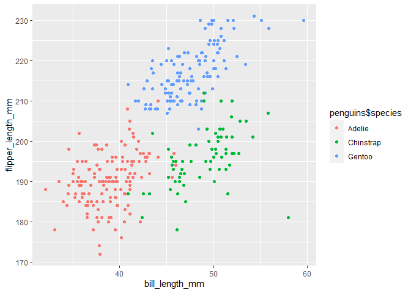

Simple document
================

DS_problem1 part1

``` r
data("penguins", package = "palmerpenguins")
summary(penguins)
```

    ##       species          island    bill_length_mm  bill_depth_mm  
    ##  Adelie   :152   Biscoe   :168   Min.   :32.10   Min.   :13.10  
    ##  Chinstrap: 68   Dream    :124   1st Qu.:39.23   1st Qu.:15.60  
    ##  Gentoo   :124   Torgersen: 52   Median :44.45   Median :17.30  
    ##                                  Mean   :43.92   Mean   :17.15  
    ##                                  3rd Qu.:48.50   3rd Qu.:18.70  
    ##                                  Max.   :59.60   Max.   :21.50  
    ##                                  NA's   :2       NA's   :2      
    ##  flipper_length_mm  body_mass_g       sex           year     
    ##  Min.   :172.0     Min.   :2700   female:165   Min.   :2007  
    ##  1st Qu.:190.0     1st Qu.:3550   male  :168   1st Qu.:2007  
    ##  Median :197.0     Median :4050   NA's  : 11   Median :2008  
    ##  Mean   :200.9     Mean   :4202                Mean   :2008  
    ##  3rd Qu.:213.0     3rd Qu.:4750                3rd Qu.:2009  
    ##  Max.   :231.0     Max.   :6300                Max.   :2009  
    ##  NA's   :2         NA's   :2

1.the data including species island bill_length_mm bill_depth_mm
flipper_length_mm body_mass_g sex year 2. the size is 344rows(with one
row of NA) 8columns we can use 344 and 8 to check out the 3.the flipper
length is 200.9152047 mm

part2

``` r
penguins <- na.omit(penguins)
plot_df=
  tibble(
    bill_length_mm = penguins$bill_length_mm,
    flipper_length_mm = penguins$flipper_length_mm
  )
ggplot(plot_df,aes(x=bill_length_mm,y=flipper_length_mm))+geom_point(aes(color=penguins$species))
```

<!-- -->

``` r
ggsave("scatterplot of h1.pdf")
```

    ## Saving 7 x 5 in image

H1_problem2

``` r
df=tibble(
    norm_number = rnorm(10),
    norm_logic=norm_number>0,
    norm_charactor= as.character(norm_number),
    
    ##factor1= as.factor(norm),
    factor2=c(1,2,3,1,2,3,1,2,3,1),
    factor4=as.factor(factor2),
    norm_factor=factor(c("1","2","3","1","2","3","1","2","3","1"),levels=c("1","2","3"))
  )
```

The mean of norm_number is -0.1499342 The mean of norm_logic is 0.5 The
mean of norm_charactor is NA The mean of norm_factor is NA

``` r
as.numeric(df$norm_charactor)
```

    ##  [1] -0.802516535 -1.141141216  1.693564366 -0.597538747  1.045745696
    ##  [6] -2.169721254  0.182270213  0.006821296 -0.271936767  0.555111006

``` r
as.numeric(df$norm_factor)
```

    ##  [1] 1 2 3 1 2 3 1 2 3 1

The mean of charactor is -0.1499342. The mean of norm_factor is 1.9.

Note:pay attention to the type of each vector variable.
